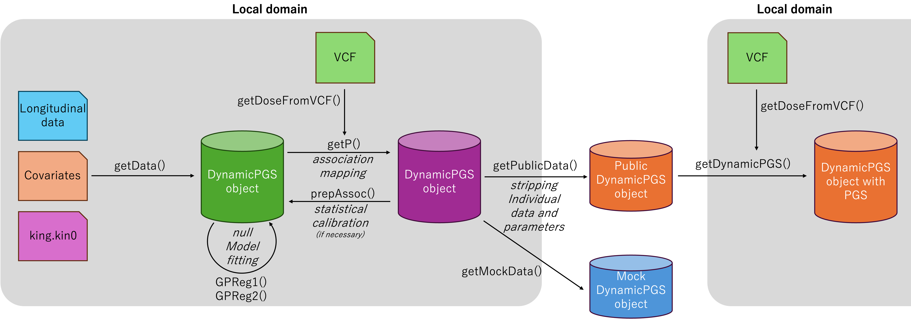

# DynamicPGS

DynamicPGS is an R package for Gaussian-process modelling of longitudinal phenotypes, dynamic genetic association testing, and dynamic polygenic score (dynamic PGS) calculation over a continuous index such as age or time.

The package supports two main workflows:

1. **Full model fitting and dynamic association mapping using your own longitudinal data.**
2. **Dynamic PGS calculation using a public DynamicPGS model and genotype dosages from your own VCF.**



## Installation

Install DynamicPGS from GitHub:

```bash
git clone https://github.com/natsuhiko/DynamicPGS.git
R CMD INSTALL DynamicPGS
```

Then load the package in R:

```r
library(DynamicPGS)
```

During package development, use `devtools::load_all()` rather than sourcing individual files such as `source("R/getData.R")`. Sourcing individual files can create conflicts between objects in the global environment and functions loaded from the package namespace.

## Quick start: compute dynamic PGS using the public BMI model

This section shows how to compute dynamic PGS using the public pre-trained BMI model included in the package.

### 1. Load the public model

```r
library(DynamicPGS)
data(adata_jecs_public)

adata_jecs_public
head(adata_jecs_public$proxy)
```

`adata_jecs_public` is a public DynamicPGS object. Individual-level phenotype data have been removed, while the model parameters required for dynamic PGS calculation have been retained.

The proxy table contains the lead variants used by the model and their candidate proxy variants. Variant IDs are represented as:

```text
CHR:POS:REF:ALT
```

The public BMI model uses variant definitions based on GRCh38. If your VCF is based on another genome build, such as GRCh37/hg19, map the coordinates and alleles to the GRCh38 representation before computing dynamic PGS.

### 2. Extract genotype dosages from a VCF file

DynamicPGS reads dosage values from a bgzip-compressed and indexed VCF/BCF file using `bcftools query`.

```r
lead_variants <- unique(adata_jecs_public$proxy[, 1])

G <- getDoseFromVCF(
  vcf = "/path/to/your/imputed.vcf.gz",
  variants = lead_variants,
  field = "DS",
  BCFTOOLS = "bcftools"
)
```

The returned object `G` is a numeric dosage matrix with variants in rows and samples in columns.

```r
dim(G)
head(rownames(G))
head(colnames(G))
```

In `variants` mode, `getDoseFromVCF()` first extracts records overlapping the requested positions and then retains only records whose chromosome, position, reference allele, and alternate allele exactly match the requested `CHR:POS:REF:ALT` IDs. Missing variants are returned as rows filled with `NA`.

If your VCF does not contain some of the lead variants, you may use proxy variants listed in `adata_jecs_public$proxy`. The public model includes `Beta` and `Sinv` entries for these proxy variants. Therefore, when proxy variants are used, the row names of `G` must remain the actual proxy variant IDs in `CHR:POS:REF:ALT` format. Do not rename proxy variants back to the original lead variant IDs. `getDynamicPGS()` matches variants by `intersect(rownames(G), rownames(adata$Beta))`; therefore, incorrect row names can cause the function to use the wrong variant-specific effect sizes `Beta`.

### 3. Compute dynamic PGS

Dynamic PGS can be evaluated at arbitrary values of the index, for example from 0 to 54 months.

```r
adata_with_pgs <- getDynamicPGS(
  adata = adata_jecs_public,
  Gall = G,
  xstar = 0:54
)
```

The dynamic PGS estimates are stored in the `PGS` element of the returned object. Rows correspond to the evaluated points in `xstar`, and columns correspond to individuals.

```r
dim(adata_with_pgs$PGS)
adata_with_pgs$PGS[1:10, 1:10]
```

The corresponding standard errors are stored in `PGS_SE`.

```r
dim(adata_with_pgs$PGS_SE)
adata_with_pgs$PGS_SE[1:10, 1:10]
```

Plot the dynamic PGS for the first individual:

```r
plot(adata_with_pgs, i = 1)
```

By default, `getDynamicPGS()` uses the allele frequencies stored in the public model when available. This assumes that allele frequencies in your target population are reasonably similar to those in the reference population.

To estimate allele frequencies from your dosage matrix instead, set `af = NULL`:

```r
adata_with_pgs <- getDynamicPGS(
  adata = adata_jecs_public,
  Gall = G,
  xstar = 0:54,
  af = NULL
)
```

You can also supply a named allele-frequency vector:

```r
adata_with_pgs <- getDynamicPGS(
  adata = adata_jecs_public,
  Gall = G,
  xstar = 0:54,
  af = af_vector
)
```

In this case, `names(af_vector)` should match the variant IDs used by the model.

## Full workflow: fit DynamicPGS to your own data

This workflow fits the null Gaussian-process model, performs dynamic association mapping, and computes dynamic PGS from the resulting effect estimates.

### 1. Prepare longitudinal phenotype data

The phenotype table must contain at least the following columns:

| Column | Description |
|---|---|
| `IID` | Individual ID |
| `x` | Continuous index, for example age in months |
| `y` | Phenotype value |

Example:

```text
IID     x      y
id001   6      16.2
id001   12     18.4
id002   6      15.8
id002   18     20.1
```

Each row corresponds to one observation. Multiple rows may belong to the same individual. The current implementation assumes that there are no duplicated observations at the same `x` value within the same individual.

A small mock dataset is included under `data/MockData/`, so the full workflow can be tested without preparing external files.

```text
data/MockData/phenotype.tsv
```

### 2. Prepare covariates

Covariates can be supplied as a `data.frame` or as a file. The number of rows in the covariate table must match the number of rows in the phenotype table before missing-value filtering.

Numeric covariates are standardised internally. Character or factor covariates are expanded into dummy variables. The following mock covariate file is included:

```text
data/MockData/covariates.tsv
```

### 3. Prepare relatedness information

Relatedness can be supplied as a KING pairwise relatedness result. The table must contain at least:

| Column | Description |
|---|---|
| `ID1` | First individual ID |
| `ID2` | Second individual ID |
| `Kinship` | KING kinship estimate |

If no KING file is supplied, all individuals are treated as unrelated. A mock KING file is included at:

```text
data/MockData/king.kin0
```

## Constructing the null model

### 1. Create a DynamicPGS object

```r
# in the package directory
adata <- getData(
  Data = "data/phenotype.tsv",
  Covariates = "data/covariates.tsv",
  king = "data/king.kin0",
  inducing_points = 0:11*5
)
```

The returned object has class `DynamicPGS`.

```r
adata
```

The print method shows a short summary, including the number of observations, number of individuals, maximum family size, support of the continuous index, and covariate structure.

### 2. Fit the population-level GP model

```r
adata <- GPReg1(
  adata,
  Verbose = TRUE
)
```

`GPReg1()` estimates the population-level smooth trajectory, covariate variance components, the GP length-scale parameter `rho`, and the residual variance.

### 3. Fit individual-level dynamic deviation components

```r
adata <- GPReg2(
  adata,
  ncore = 4,
  Verbose = TRUE
)
```

`GPReg2()` estimates variance components for individual-specific dynamic deviations. Using as many CPU cores as practical is strongly recommended, because the function repeatedly computes kernel submatrices for each individual.

At the end of optimisation, `GPReg2()` automatically calls `prepAssoc()` to prepare matrices used for dynamic association testing.

If needed, association-mapping matrices can be recomputed explicitly:

```r
adata <- prepAssoc(
  adata,
  r_rho = 1.2,
  r_delta2d = 1.05,
  ncore = 4
)
```

## Genotype dosage input preparation

### Read dosages from an indexed VCF or BCF

To extract all variants in a region:

```r
G <- getDoseFromVCF(
  vcf = "dose.vcf.gz",
  region = "chr1:100000-200000",
)
```

To extract selected variants:

```r
variants <- c("chr1:12345:A:G", "chr1:67890:C:T")

G <- getDoseFromVCF(
  vcf = "dose.vcf.gz",
  variants = variants,
)
```

If the VCF contains a `DS` field, dosages are read from `DS`. If you set `field = "GT"`, genotypes are converted to alternate-allele dosages.

The expected dosage matrix format is:

```text
          id001  id002  id003
variant1  0.02   1.01   2.00
variant2  1.00   0.00   0.98
```

Rows are variants and columns are individuals. Column names should correspond to the unique individual IDs in the fitted `DynamicPGS` object.

A small mock dosage dataset is included under `data/MockData/`, so the full workflow can be tested without preparing external files.

```text
data/MockData/dose.vcf.gz
```

In this dataset, chromosome "0" indicates genotype dosages simulated under the null hypothesis, and chromosome "1" indicates genotype dosages simulated under the alternative hypothesis using the 238 real BMI associations.

```r
L=238
G=rbind(
    getDoseFromVCF("/data/MockData/dose.vcf.gz",reg=paste0("0:1-",1000-L)),
    getDoseFromVCF("/data/MockData/dose.vcf.gz",reg=paste0("1:1-",L))
)
```

### Simulate dosage data

For testing and examples, genotype dosages can be simulated from allele frequencies using the relatedness structure stored in a `DynamicPGS` object.

```r
af <- c(0.10, 0.25, 0.40)
G <- simDose(adata, af, seed = 1)
```

If `af` has names in `CHR:POS:REF:ALT` format, those names are used as variant IDs.

```r
af <- c("chr1:12345:A:C" = 0.10, "chr2:23456:G:T" = 0.25)
G <- simDose(adata, af, seed = 1)
```

## Dynamic genetic association mapping

Run variant-level dynamic association mapping:

```r
adata <- getP(
  adata,
  Gall = G,
  Beta = TRUE,
  Sinv = TRUE,
  ncore = 4
)
```

Association p-values are stored in:

```r
head(adata$pval)
```

Allele frequencies estimated from the dosage matrix are stored in:

```r
head(adata$allele_frequency)
```

If `Beta = TRUE`, posterior dynamic effect estimates are stored in:

```r
adata$Beta
```

If `Sinv = TRUE`, inverse precision matrices are stored in:

```r
adata$Sinv
```

`Beta = TRUE` and `Sinv = TRUE` are recommended if the next step is dynamic PGS calculation or effect-size visualisation.

### Plot dynamic effect sizes

After running `getP()` with `Beta = TRUE` and `Sinv = TRUE`, the dynamic effect size of a variant can be plotted as follows:

```r
plotEffectSize(adata, variant = 1)
plotEffectSize(adata, variant = rownames(adata$Beta)[1])
```

To visualise genotype-specific phenotype trajectories:

```r
plotEffectSize(adata, variant = 1, genoEffect = TRUE)
```

## Compute dynamic PGS from your own association results

After dynamic association testing, compute dynamic PGS at any target values of the continuous index.

```r
adata <- getDynamicPGS(
  adata = adata,
  Gall = G,
  xstar = 0:60,
  af = adata$allele_frequency
)
```

The returned `DynamicPGS` object contains:

| Element | Description |
|---|---|
| `xstar` | Target index values |
| `pop_avg_xstar` | Estimated population-average trajectory at `xstar` |
| `PGS` | Dynamic PGS matrix, with rows corresponding to `xstar` and columns corresponding to samples |
| `PGS_SE` | Approximate standard errors of dynamic PGS |

Plot the dynamic PGS for one individual:

```r
plot(adata, i = 1)
```

## Mock data generation

DynamicPGS includes utilities for generating mock data from an existing fitted object. This is useful for testing the workflow without exposing individual-level data.

```r
mock <- getMockData(
  adata,
  Nd = 1000,
  af_null = runif(100, 0.05, 0.50),
  outdir = "mock_dynamic_pgs"
)
```

When `outdir` is supplied, the function writes example phenotype, covariate, KING, and dosage VCF files.

## Dependencies

DynamicPGS uses the following R packages:

```r
Matrix
CompQuadForm
parallel
```

External command-line tools are required for VCF input and output:

```text
bcftools
bgzip
```

`bcftools` is required by `getDoseFromVCF()`. `bgzip` and `bcftools index` are required when writing indexed VCF files with `writeDoseToVCF()`.

## Citation

Citation information will be added after manuscript or package release.

